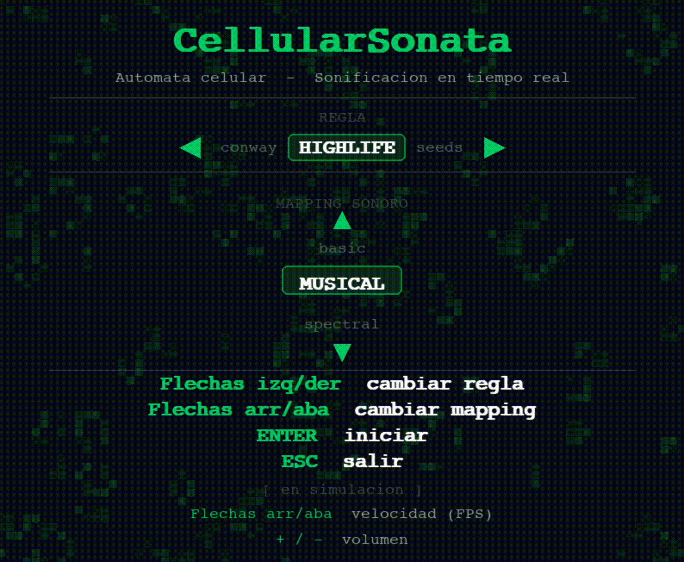

<div align="center">

# ◈ CellularSonata

**Real-time cellular automaton with procedural audio sonification**

[](https://www.python.org/)
[](https://www.pygame.org/)
[](https://numpy.org/)
[](https://scipy.org/)
[](LICENSE)
[]()

*A modular Python system that translates the emergent dynamics of cellular automata into structured real-time sound.*

---



</div>

---

## What is this?

CellularSonata maps the birth-and-death events of a Conway-style cellular automaton to synthesized audio in real time. Every cell that comes to life triggers a sound event; its column position determines pitch, its vertical zone determines timbre, and the overall population density modulates amplitude to prevent clipping.

Three independent **sonification strategies** are implemented, each embodying a different musical philosophy:

| Strategy | Principle | Result |
|----------|-----------|--------|
| `basic` | Column → linear frequency | Illustrative, chaotic |
| `musical` | Column → pentatonic scale, zone → waveform | Coherent, musical |
| `spectral` | Column density → spectral band amplitude | Abstract, textural |

The system is designed to be **extended**: adding a new automaton rule, waveform, or mapping strategy requires touching exactly one module.

---

## Quickstart

```bash
git clone https://github.com/YOUR_USERNAME/cellular-sonata.git
cd cellular-sonata

python -m venv venv && source venv/bin/activate   # Windows: venv\Scripts\activate
pip install -r requirements.txt

python main.py
```

> **Requires**: Python 3.10+, a working audio device, and a display.

### Command-line options

```bash
python main.py --rule highlife --mapping spectral
python main.py --rule seeds    --mapping basic    --width 100 --height 75
```

| Flag | Options | Default |
|------|---------|---------|
| `--rule` | `conway` `highlife` `seeds` `daynight` | `conway` |
| `--mapping` | `basic` `musical` `spectral` | `musical` |
| `--width` / `--height` | any integer | `80` / `60` |

---

## Controls (in-simulation)

| Key | Action |
|-----|--------|
| `SPACE` | Pause / step one generation |
| `R` | Randomize grid |
| `C` | Clear grid |
| `G` | Insert a glider |
| `↑` / `↓` | Speed up / slow down |
| `+` / `-` | Volume up / down |
| `M` | Mute toggle |
| `1` / `2` / `3` | Switch mapping live |
| `H` | Toggle help overlay |
| Mouse drag | Draw/erase cells |
| `ESC` | Quit |

---

## Architecture

The project follows a strict **separation of concerns**: each module has one responsibility and no circular dependencies.

```
cellular-sonata/
│
├── main.py                    # Entry point · event loop · orchestration
│
├── src/
│   ├── automata/
│   │   └── grid.py            # CA logic (NumPy vectorised + SciPy convolution)
│   │
│   ├── audio/
│   │   ├── synthesis.py       # Oscillators (sine, saw, square, triangle) + ADSR
│   │   ├── mapping.py         # Three sonification strategies + SoundEvent dataclass
│   │   └── engine.py          # pygame.mixer integration · channel pool · round-robin
│   │
│   ├── visual/
│   │   ├── splash.py          # Interactive start screen with animated background
│   │   └── renderer.py        # Grid rendering · HUD · help overlay
│   │
│   └── utils/
│       ├── config.py          # Central Config dataclass (single source of truth)
│       └── logger.py          # Structured logging
│
├── tests/
│   ├── test_grid.py           # CA rules validated with known patterns (block, blinker)
│   └── test_synthesis.py      # Audio pipeline tests (ADSR, clipping, int16 range)
│
└── docs/
    └── DEVELOPMENT_GUIDE.md   # Phase-by-phase technical walkthrough
```

### Data flow

```
Grid.step()  →  birth_mask / death_mask
                        │
               Mapper.map(grid, births, deaths)
                        │
               [SoundEvent(freq, amp, dur, waveform, pan), ...]
                        │
               AudioEngine._synthesize(event)
                        │
               numpy float64  →  ADSR  →  int16 stereo  →  pygame.Sound  →  channel.play()
```

---

## Technical decisions

### Why SciPy convolution for the automaton?

A naive double Python loop over an 80×60 grid runs ~4800 iterations per frame. At 10 FPS that is 48 000 iterations per second — slow enough to stall the display.

`scipy.signal.convolve2d` applies the Moore neighbourhood kernel to the entire grid in a single vectorised C operation, making the CA step 50–100× faster and keeping the main loop smooth.

### Why the pentatonic minor scale?

Any automatically generated combination of pentatonic minor notes is consonant — the scale contains no semitones and no tritone. This makes it robust for generative systems where note selection is determined by spatial position rather than harmonic intent. Transposing the base note in `config.py` changes the key without touching any other logic.

### Preventing clipping with many simultaneous voices

When N cells are born in the same frame, their waveforms are summed. Naïve summation overflows int16 (clipping = hard distortion). Two defences are used:

1. **Per-voice amplitude scaling** — each voice receives amplitude `∝ 1/√N`, which conserves total acoustic power regardless of polyphony count.
2. **Post-mix normalisation** — `mix_waves()` divides by the peak if it exceeds 1.0, as a last resort.

### ADSR envelope

Without an attack/release ramp, the abrupt start and stop of each waveform creates a click artefact (a Gibbs-phenomenon discontinuity in the time domain). A 10 ms attack and 150 ms release eliminate the click while keeping notes percussive.

---

## Supported automaton rules

| Rule | Notation | Character |
|------|----------|-----------|
| Conway's Game of Life | B3/S23 | Rich, oscillators, gliders |
| HighLife | B36/S23 | Produces self-replicators |
| Seeds | B2/S | Explosive, no survivors |
| Day & Night | B3678/S34678 | Symmetric: dead mirrors alive |

---

## Running the tests

```bash
pip install pytest
pytest tests/ -v
```

Tests validate:
- CA rules against known still-lifes and oscillators (block, blinker)
- ADSR envelope boundaries (starts and ends at silence)
- Audio pipeline range (no int16 overflow)
- Mix normalisation (no clipping with N simultaneous voices)

---

## Extending the project

The modular design makes additions local to one file:

**New automaton rule** → add entry to `RULES` dict in `grid.py`  
**New waveform** → add generator function in `synthesis.py`, register in `GENERATORS` dict in `engine.py`  
**New mapping** → subclass or add a new class in `mapping.py`, register in `get_mapper()`  
**New visual mode** → add a draw method in `renderer.py`

### Ideas for future work

- [ ] MIDI export of generated SoundEvents via `music21`
- [ ] FM synthesis oscillator (carrier + modulator)
- [ ] Real-time FFT display of the mixed audio signal
- [ ] Audio recording to `.wav` via `scipy.io.wavfile`
- [ ] Custom B/S rule input from the splash screen
- [ ] JSON preset save/load for grid states
- [ ] Granular synthesis mode (each cell = audio grain)

---

## Dependencies

| Package | Version | Role |
|---------|---------|------|
| `pygame` | ≥ 2.5 | Display, event loop, audio mixer |
| `numpy` | ≥ 1.24 | Grid state, waveform generation, vectorised ops |
| `scipy` | ≥ 1.11 | `convolve2d` for CA neighbour counting |

No proprietary libraries. No internet connection required at runtime.

---

## Academic context

This project was developed as coursework for a **Sonology** programme. It explores the intersection of:

- **Dynamical systems** — cellular automata as models of emergence and computational universality
- **Sound mapping** — the compositional question of how to translate a non-audio domain into auditory parameters
- **Real-time digital synthesis** — procedural waveform generation, ADSR envelopes, polyphony management

### Selected references

- Gardner, M. (1970). Mathematical games: The fantastic combinations of John Conway's new solitaire game "life". *Scientific American*, 223(4), 120–123.
- Roads, C. (1996). *The Computer Music Tutorial*. MIT Press.
- Wishart, T. (1996). *On Sonic Art*. Harwood Academic Publishers.
- Kramer, G. et al. (1999). *Sonification Report: Status of the Field and Research Agenda*. ICAD.
- Flake, G. W. (1998). *The Computational Beauty of Nature*. MIT Press.

---

## License

[MIT](LICENSE) — free for academic and personal use.

---

<div align="center">

*Built with Python · pygame · NumPy · SciPy*

</div>
